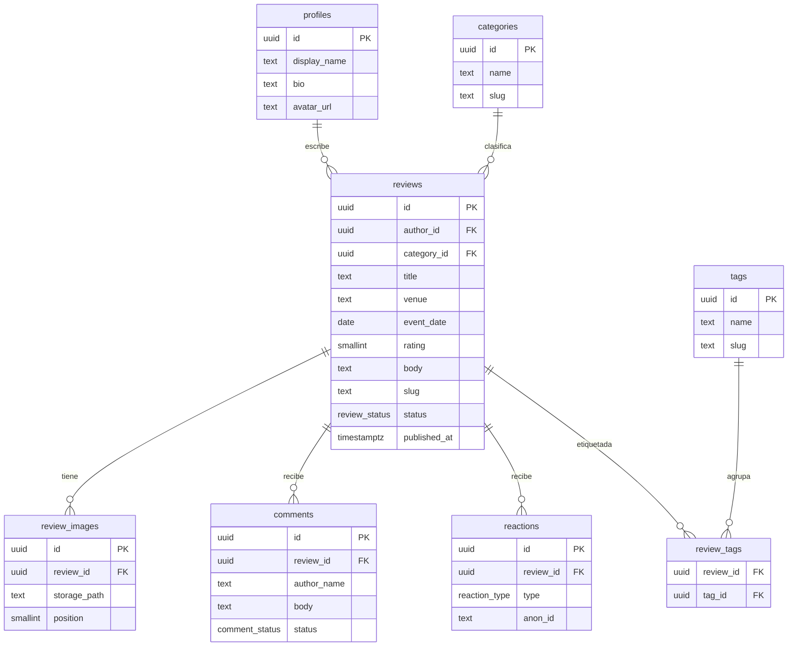

# Fuera de Escena BB — Arquitectura y diseño técnico

> Documento base del proyecto. Sirve como referencia para el equipo y como
> `ARCHITECTURE.md` del repositorio. Versión 1 — pensado para iterar.

---

## 1. Decisión de arquitectura

### MVC vs MVP: por qué la pregunta necesita un ajuste

MVC (Model-View-Controller) y MVP (Model-View-Presenter) son patrones que
nacieron en contextos concretos:

- **MVC** es natural en frameworks de servidor "clásicos": Rails, Laravel,
  Django, Spring MVC, ASP.NET MVC. El *controller* recibe el request, coordina
  el *model* y devuelve una *view*.
- **MVP** viene del mundo de UI de escritorio/móvil (Android histórico, WinForms,
  GWT): la *view* es pasiva y el *presenter* concentra toda la lógica.

En una app moderna con **Next.js/React**, ninguno de los dos calza tal cual: React
es basado en componentes + hooks, y Next mezcla render en servidor y cliente. Forzar
MVC/MVP ahí genera fricción y código artificial.

El equivalente profesional para este stack es una **arquitectura por capas +
organización por features** (a veces llamada *clean architecture* liviana o
*feature-sliced*). Separa las mismas responsabilidades que buscás con MVC —
datos, lógica, presentación — pero de forma idiomática para React/Next.

### Los dos caminos coherentes

| | Camino A — Next.js + Supabase *(recomendado)* | Camino B — MVC clásico con backend propio |
|---|---|---|
| **Arquitectura** | Por capas + features | MVC de manual |
| **Stack** | Next.js (front+lógica) + Supabase (BaaS) | Backend NestJS/Django/Laravel + front separado |
| **Base de datos** | Postgres administrado (Supabase) | Postgres propio |
| **Infra** | Serverless, casi cero mantenimiento | Servidor + DB a mantener |
| **Costo** | Plan gratis alcanza de sobra | Hosting de backend + DB |
| **Cuándo elegirlo** | Proyecto chico/mediano, un solo autor, mucha lectura | Necesitás MVC textual, equipo grande, lógica de servidor pesada |

**Recomendación para este proyecto:** Camino A. Una crítica de teatro local, con
una sola autora que publica y público que lee/comenta/reacciona, no justifica
mantener un backend aparte. Supabase te da auth, base de datos y storage de
imágenes en un solo lugar, y el plan gratuito sobra para este tráfico.

> Si más adelante querés el patrón MVC estricto con backend propio, el candidato
> es **NestJS** (TypeScript, estructura de controllers/services/modules muy
> cercana a MVC). El diseño de base de datos de este documento sirve igual para
> ese camino.

---

## 2. Stack tecnológico (Camino A)

| Capa | Tecnología | Por qué |
|---|---|---|
| Framework | **Next.js 15** (App Router) + **React 19** | Render en servidor, rutas, Server Actions, SEO para que Google indexe las críticas |
| Lenguaje | **TypeScript** | Tipado end-to-end, menos bugs |
| Estilos | **Tailwind CSS** + **shadcn/ui** | Rápido y prolijo; matchea el look limpio del demo |
| Backend / datos | **Supabase** | Postgres + Auth + Storage + Row Level Security, todo integrado |
| Auth | **Supabase Auth** (email + contraseña) | El login privado de la autora |
| Validación | **Zod** | Valida datos en front y en Server Actions (rating 1–5, campos requeridos) |
| Formularios | **React Hook Form** | Formulario de "Nueva crítica" y comentarios |
| Imágenes | **Supabase Storage** + `next/image` | Subida hasta 2 imágenes, optimización automática |
| Deploy | **Vercel** (o **Netlify**, que ya venís usando) | CI/CD, dominio, HTTPS |

---

## 3. Arquitectura de la aplicación (capas)

Separación de responsabilidades, organizada por feature:

```
src/
├── app/                      # Rutas (App Router): páginas, layouts, server actions
│   ├── (public)/             # Home, listado y detalle de críticas (lectura pública)
│   ├── (author)/             # Panel privado: crear/editar/moderar (requiere auth)
│   └── api/                  # Endpoints puntuales si hicieran falta
│
├── features/                 # Lógica agrupada por dominio
│   ├── reviews/
│   │   ├── components/        # UI (capa presentación)
│   │   ├── actions.ts         # Server Actions (capa aplicación / casos de uso)
│   │   ├── queries.ts         # Acceso a datos → Supabase (capa data access)
│   │   └── schema.ts          # Tipos + validación Zod (capa dominio)
│   ├── comments/
│   └── reactions/
│
├── components/ui/            # Design system (shadcn/ui)
├── lib/
│   └── supabase/             # Clientes de Supabase (server / browser)
└── types/                    # Tipos compartidos (generados desde la DB)
```

Correspondencia con MVC, para que se entienda el mapeo:

- **Model** → `schema.ts` (dominio) + `queries.ts` (acceso a datos)
- **Controller / lógica** → `actions.ts` (Server Actions orquestan los casos de uso)
- **View** → `components/` y las rutas en `app/`

---

## 4. Diseño de la base de datos

Ocho tablas. `profiles` extiende la tabla `auth.users` de Supabase.



### Decisiones de modelado

- **`profiles`**: hoy hay una sola autora, pero la dejamos como tabla para no
  atarnos. El login lo maneja `auth.users` de Supabase; `profiles` guarda los
  datos públicos.
- **`review_images`** como tabla aparte (no una columna array): permite `alt_text`
  por imagen y controlar orden con `position` (1 o 2). Más prolijo y extensible.
- **`tags` + `review_tags`** (relación N:M): las "palabras clave" del demo,
  normalizadas. Permite filtrar y reusar etiquetas.
- **`comments.status`**: incluye moderación (`pending`/`approved`/`rejected`).
  Al ser comentarios públicos y anónimos, conviene poder moderar.
- **`reactions.anon_id`**: como el público no está logueado, guardamos un id
  anónimo (cookie/localStorage) para evitar que una persona reaccione mil veces.
  El `UNIQUE(review_id, type, anon_id)` fuerza una reacción por tipo por persona.

---

## 5. Seguridad — Row Level Security (RLS)

RLS es lo que hace cumplir "solo la autora publica/edita" a nivel base de datos,
no solo en el front. Resumen de políticas:

| Tabla | Lectura pública | Escritura |
|---|---|---|
| `reviews` | Solo `status = 'published'` | Solo la autora (`author_id = auth.uid()`) |
| `review_images`, `review_tags` | Si la crítica está publicada | Solo la autora |
| `categories`, `tags` | Sí | Solo la autora |
| `comments` | Solo `status = 'approved'` | INSERT público (queda `pending`); moderación solo autora |
| `reactions` | Sí | INSERT público |

**Storage**: bucket `review-images` con lectura pública y escritura solo
autenticada.

---

## 6. Manejo de imágenes

1. La autora elige hasta 2 imágenes en el formulario de "Nueva crítica".
2. Se suben al bucket `review-images` de Supabase Storage.
3. Se guarda el `storage_path` en `review_images`.
4. En el front se renderizan con `next/image` (optimización, lazy-load, tamaños).

---

## 7. SQL de migración inicial

Listo para pegar en el **SQL Editor de Supabase**.

```sql
-- Enums
create type review_status  as enum ('draft', 'published');
create type comment_status as enum ('pending', 'approved', 'rejected');
create type reaction_type  as enum ('like', 'love', 'wow', 'applause');

-- Perfil de la autora (extiende auth.users)
create table profiles (
  id           uuid primary key references auth.users(id) on delete cascade,
  display_name text,
  bio          text,
  avatar_url   text,
  created_at   timestamptz not null default now()
);

-- Categorías
create table categories (
  id         uuid primary key default gen_random_uuid(),
  name       text not null unique,
  slug       text not null unique,
  created_at timestamptz not null default now()
);

-- Críticas
create table reviews (
  id           uuid primary key default gen_random_uuid(),
  author_id    uuid not null references profiles(id),
  category_id  uuid references categories(id),
  title        text not null,
  venue        text,
  event_date   date,
  rating       smallint check (rating between 1 and 5),
  body         text not null,
  slug         text not null unique,
  status       review_status not null default 'draft',
  published_at timestamptz,
  created_at   timestamptz not null default now(),
  updated_at   timestamptz not null default now()
);

-- Imágenes (hasta 2 por crítica)
create table review_images (
  id           uuid primary key default gen_random_uuid(),
  review_id    uuid not null references reviews(id) on delete cascade,
  storage_path text not null,
  alt_text     text,
  position     smallint not null check (position in (1, 2)),
  created_at   timestamptz not null default now(),
  unique (review_id, position)
);

-- Tags / palabras clave (N:M)
create table tags (
  id   uuid primary key default gen_random_uuid(),
  name text not null unique,
  slug text not null unique
);

create table review_tags (
  review_id uuid references reviews(id) on delete cascade,
  tag_id    uuid references tags(id)    on delete cascade,
  primary key (review_id, tag_id)
);

-- Comentarios (públicos, con moderación)
create table comments (
  id          uuid primary key default gen_random_uuid(),
  review_id   uuid not null references reviews(id) on delete cascade,
  author_name text not null,
  body        text not null,
  status      comment_status not null default 'pending',
  created_at  timestamptz not null default now()
);

-- Reacciones (públicas, deduplicadas por id anónimo)
create table reactions (
  id         uuid primary key default gen_random_uuid(),
  review_id  uuid not null references reviews(id) on delete cascade,
  type       reaction_type not null,
  anon_id    text not null,
  created_at timestamptz not null default now(),
  unique (review_id, type, anon_id)
);

-- Índices útiles
create index idx_reviews_status      on reviews(status, published_at desc);
create index idx_comments_review     on comments(review_id, status);
create index idx_reactions_review    on reactions(review_id);
```

> Las políticas de RLS (sección 5) se agregan en una segunda migración una vez
> definido el comportamiento fino de moderación.

---

## 8. Próximos pasos sugeridos

1. Crear proyecto en Supabase y correr esta migración.
2. Scaffold del proyecto Next.js con Tailwind + shadcn/ui.
3. Auth de la autora (login privado).
4. CRUD de críticas + subida de imágenes.
5. Vista pública: listado + detalle.
6. Comentarios y reacciones.
7. Panel de moderación de comentarios.
8. Deploy.